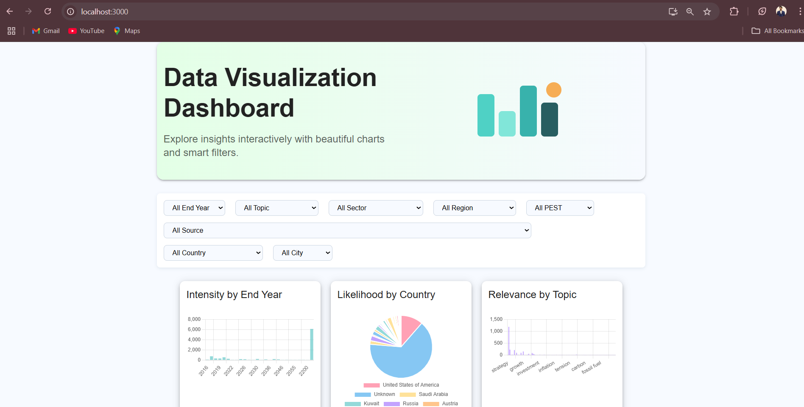

# Data Visualization Dashboard

Welcome! This is a project I built to explore and visualize a large dataset using modern web technologies. The dashboard lets you filter, analyze, and gain insights from the data interactively. I wanted to make something that's not only functional but also easy and enjoyable to use.

## Features
- Import and visualize data from a provided JSON file
- Interactive filters: End Year, Topic, Sector, Region, PEST, Source, Country, City, etc.
- Dynamic, creative charts (Chart.js) for Intensity, Likelihood, Relevance, and more
- Responsive, modern UI (Material UI or plain CSS)
- Backend API with flexible filtering

## Tech Stack
- **Backend:** Node.js, Express, Mongoose, MongoDB
- **Frontend:** React.js, Chart.js, (Material UI or plain CSS)
- **Database:** MongoDB (local or Atlas)

---

## Getting Started (Local)

### 1. Clone the Repository
```sh
git clone <your-repo-url>
cd <project-folder>
```

### 2. Install Dependencies
```sh
npm install
cd dashboard-frontend
npm install
cd ..
```

### 3. Import Data to MongoDB
- Make sure MongoDB is running locally or use MongoDB Atlas.
- Place your `jsondata.json` in the root folder.
- Import data:
```sh
node importData.js
```

### 4. Start the Backend
```sh
node server.js
```
- The backend runs on [http://localhost:5000](http://localhost:5000)

### 5. Start the Frontend
```sh
cd dashboard-frontend
npm start
```
- The frontend runs on [http://localhost:3000](http://localhost:3000)

---

## API Endpoints
- `GET /api/data` — Get data (supports filters as query params)
- `GET /api/filters/:field` — Get unique values for a field (for filters)

---

## Example Usage
- Select filters to update the dashboard charts interactively
- Explore insights by year, topic, region, etc.

---

## Screenshots



---

## License
MIT 